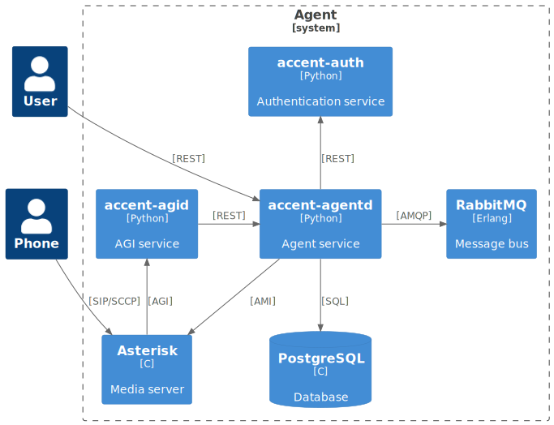
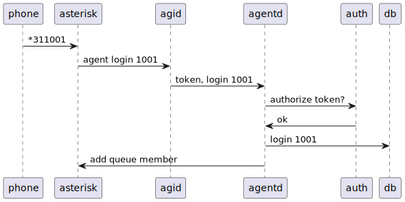

# [agentd](https://github/ryanwclark1/accent-agentd)

accent-agentd is the service responsible of managing agent which are used to distribute calls received on queues in a call center use case.

It can do the following actions:

* log in
* log out
* pause
* resume

## Schema

## Example

## API documentation

The REST API for accent-agentd is available [here](../api/agent.html)

## Related

* [accent-auth](authentication.html)

## See also

* [Dev notes](agent-core.html)
