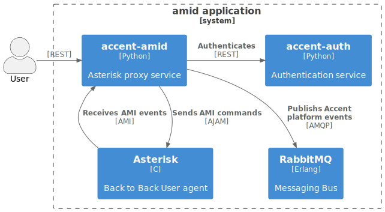

# [`amid`](https://github/ryanwclark1/accent-amid)

## Description

A daemon for interacting with [Asterisk's AMI](https://docs.asterisk.org/Configuration/Interfaces/Asterisk-Manager-Interface-AMI) :

- forward AMI events to RabbitMQ ;
- expose HTTP JSON interface for AMI actions.

Once a user is authenticated against Accent platform, he can query the `amid` service to receive `AMI` events from Asterisk and push `AMI` command to it.

The `amid` service also proxies the AMI event to our event bus.

## Schema

## API documentation

The REST API for accent-ami is available [here](../api/amid.html)

## Related

- [accent-amid](https://github/ryanwclark1/accent-amid)
- [accent-amid-client](https://github/ryanwclark1/accent-amid-client)
