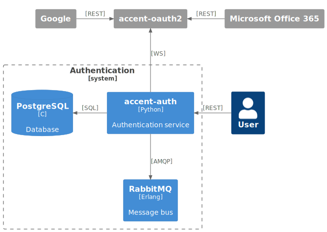

# [auth](https://github/ryanwclark1/accent-auth)

accent-auth is the authentication server used by the Accent platform.

accent-auth is used to:

- create and store tokens
- validate tokens and permissions
- create and manage users
- create and manage user groups
- create and manage policies (named group of permissions).
- bootstrap third party authentication for Microsoft and Google
- store tokens for Google and Microsoft
- handle SAML authentication

## Schema

- accent-oauth2 is used to complete the OAuth 2.0 token creation process for third party authentications

## Example

## API documentation

The REST API for accent-auth is available [here](../api/authentication.html).

The bus events are defined [here](https://github/ryanwclark1/accent-bus/blob/master/accent_bus/resources/auth/events.py).

The database tables are defined [here](https://github/ryanwclark1/accent-auth/blob/master/accent_auth/database/models.py).

The SAML based login is available using SAML accent-auth APIs, more details are available in its [documentation](../api/authentication.html).
To be able to use it you need to install the federation metadata XML file and add the corresponding configuration file. Please check
the example in the accent-auth [sources](https://github/ryanwclark1/accent-auth/blob/master/etc/accent-auth/config.yml).

## Policies

A policy is a list of access that is used to access Accent resources.
Policies can be created, deleted or modified using the REST API.

## Tokens

A token is used to identify and authorize all HTTP queries done on the accent-platform. Each token has an expiration
and can be revoked by the user.

The token should be added to each subsequent HTTP request using the 'X-Auth-Token' HTTP header.

## Service Authentication

Accent services expose more and more resources through REST API, but they also ensure that the access
is restricted to the authorized programs.

### Call flow

Here is the call flow to access a REST resource of a Accent service:

1. Create a username/password (also called service_id/service_key) with the right ACL.
2. Create a token with these credentials.
3. Use this token to access the REST resource requiring the ACL

TODO: Add a sequence diagram

- Service: Service who needs to access a REST resource.
- accent-{daemon}: Server that exposes a REST resource. This resource must have a required ACL.
- accent-auth: Server that authenticates the `Service` and validates the required ACL with the token.

Accent services directly use this system to communicate with each other, as you can see in their Web
Services Access.

# [`call-logd`]

Collect metadata on calls made on a Accent Platform, allowing users to see their calls' history.

This is service accessible via REST API.

Call logs are pre-generated from CEL entries. The generation is done
automatically by `accent-call-logd`. accent-call-logs is also run nightly to
generate call logs from CEL that were missed by `accent-call-logd`.

## Schema

## Usage example

# accent-calld

accent-calld is the call control service for the Accent platform.

It manages the following resources:

* applications
* calls
* fax
* relocates
* switchboards
* transfers
* voicemails

## API documentation

The REST API for accent-calld is available [here](../api/application.html#tag/applications).

The bus events are defined [here](https://github/ryanwclark1/accent-calld/blob/master/accent_calld/plugins/calls/events.yml) and [here](https://github/ryanwclark1/accent-calld/blob/master/accent_calld/plugins/switchboards/events.yml).

## Schema

# [`chatd`](https://github/ryanwclark1/accent-chatd)

Add messaging functionality, as well as devices and users presence for a Accent Platform.

This is service accessible via REST API.

## Schema

## Usage example

# [`accent-confd`](https://github/ryanwclark1/accent-confd)

Configuring and managing PBX part of Accent Platform.

* Agents
* Applications
* Asterisk configuration
* Call filters
* Call permissions
* Call pickups
* Conferences
* Configuration
* Contexts
* DHCP
* Devices
* Endpoints custom
* Endpoints iax
* Endpoints sccp
* Endpoints sip
* Extensions
* Function keys
* Groups
* High availability
* IVR
* Incoming calls
* Lines
* Music on hold
* Outgoing calls
* Pagings
* Parking lots
* Queues skills
* Queues
* Registers
* Sounds
* Switchboards
* Trunks
* Users
* Voicemails

## Schema

## First example

## Second example: Create a user with a phone and a voicemail

Setup workflow, details to create resources as described afterward:

* First, associate a `line` to an `extension ;
* Then, associate an `user` to the `line` ;
* Then associate an `endpoint` with the `line` ;
* Then associate a `device` with the `line` ;
* Finally, associate `voicemail` to the `user`.

