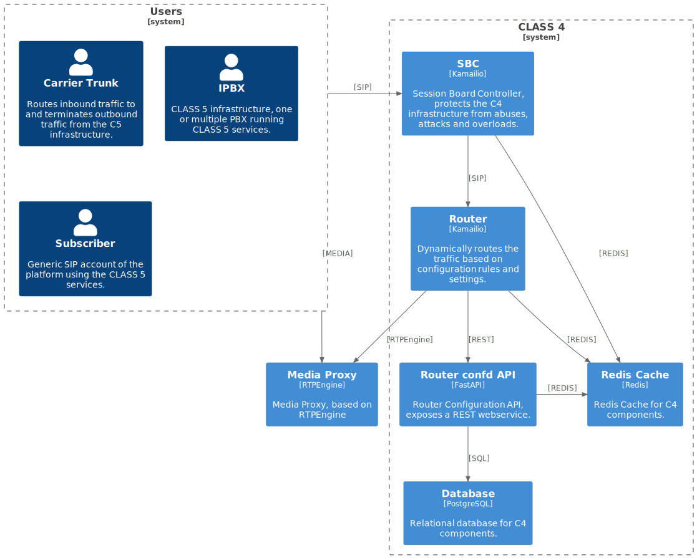

# [c4-sbc](https://github/ryanwclark1/accent-c4-sbc)

This is the SBC (Session Border Controller) component of the Accent Platform C4 (Class 4).

## Schema

## Features of the SBC

* Security
* NAT management
* Protocol translation
* Load balancing and horizontal scaling
* High availability

### Security

Fraud represents a severe threat to the telecommunication industry. It refers to the abuse of telecommunications services as VoIP is a prime target of attacks:

* significant gains and some impunity
* listening and diversion
* DDoS

One of the critical features for our users was to have active protection on denial of service attacks, limit the number of scanners and consequently guarantee adequate resources to provide the essential services.

Accent SBC supports anti-DDoS, scanner detection and limit, packet validation, and normalization out-of-the-box.

### NAT management

The use of private IPv4 addresses is an everyday reality for our users. The IPv6 deployment, unfortunately, is still under implementation. For this reason, handling NAT is a mandatory requirement for our C4 interfacing the public IP network.

Accent SBC supports NAT out-of-the-box.

### Protocol translation

VoIP is using different transport protocols and IP versioning. Being at the edge of the network, the C4 must manage various transport protocols, decrypt the TLS flows and extract/encapsulate the SIP and WebRTC streams.

Accent SBC currently supports SIP over TPC/UDP translation.

### Load balancing

An essential feature for an SBC, the load balancer provides a means to route calls to a set of routers to offer the possibility to horizontally and dynamically scale the infrastructure to cope with the variable traffic over time.

Accent SBC supports both manual configurations of the load balancer, which allows users to specify an explicit list of routers, or dynamic configuration through the service discovery system based on Consul.

### High availability

The SBC  is the primary contact point for all the calls, and it must be resilient to errors and outages. The Accent SBC provides Redis-based synchronization of the dialogs to offer High Availability. It is possible to use external UDP load balancers, IPVS-based load balancers, or floating IPs.

## Part of the Accent Platform C4

A Class 4 Softswitch routes large volumes of usually long-distance VoIP calls. For businesses that want to interconnect their VoIP servers, a Class 4 Softswitch is used to relay VoIP traffic and services over multiple IP networks. C4 soft switches provide intelligent call routing, which reduces congestion, latency, and costs while improving the quality of VoIP calls. They have several security features to protect the C5 switches.

The main characteristics of a C4 Softswitch are:

* route large volume of calls
* protocol support and conversion
* transcoding
* billing interface
* security management
* call authentication
* call authorization

Accent Platform aims to offer to service providers, enterprises, and digital natives a coherent and complete reference platform for the design, deployment, and management of a telecom infrastructure that can support massive volumes of simultaneous calls by interconnecting millions of users.

The solution must be able to handle mission-critical needs by providing robust and efficient mechanisms for availability and scalability.

## Related

* [accent-router-confd](router-confd.html)
* [accent-c4-router](c4-router.html)
* [accent-rtpe](rtpe-config.html)
