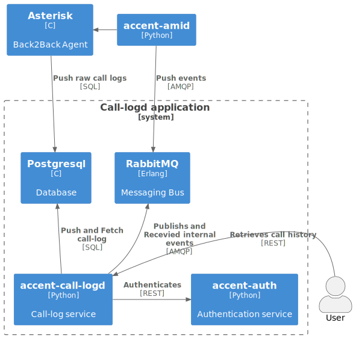
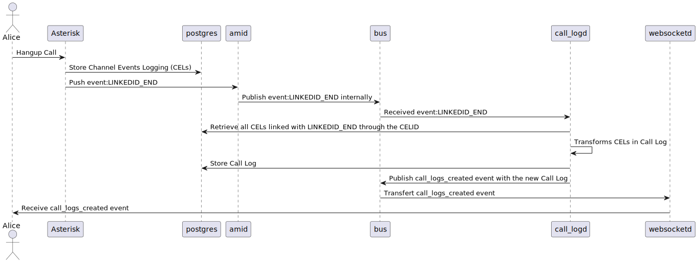

# [`call-logd`](https://github/ryanwclark1/accent-call-logd)

Collect metadata on calls made on a Accent Platform, allowing users to see their calls' history.

This is service accessible via REST API.

## Schema

## Usage example

## API documentation

The REST API for accent-call-logd is available [here](../api/cdr.html)

## Related

* [accent-auth](https://github/ryanwclark1/accent-auth)

## See also

* [Admin notes](cdr-admin.html)
