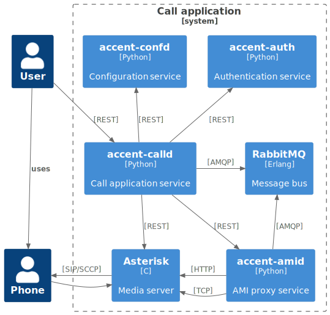

# accent-calld

accent-calld is the call control service for the Accent platform.

It manages the following resources:

* applications
* calls
* fax
* relocates
* switchboards
* transfers
* voicemails

## API documentation

The REST API for accent-calld is available [here](../api/application.html#tag/applications).

The bus events are defined [here](https://github/ryanwclark1/accent-calld/blob/master/accent_calld/plugins/calls/events.yml) and [here](https://github/ryanwclark1/accent-calld/blob/master/accent_calld/plugins/switchboards/events.yml).

## Schema

## Example

## Related

* [accent-amid](amid.html)
* [accent-auth](authentication.html)
* [accent-confd](configuration.html)

## See also

* [Dev notes](application-dev.html)
