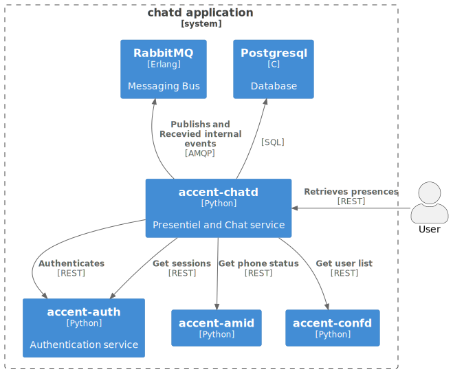
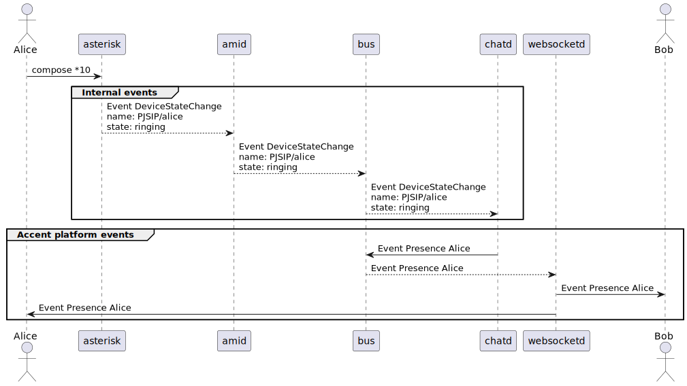
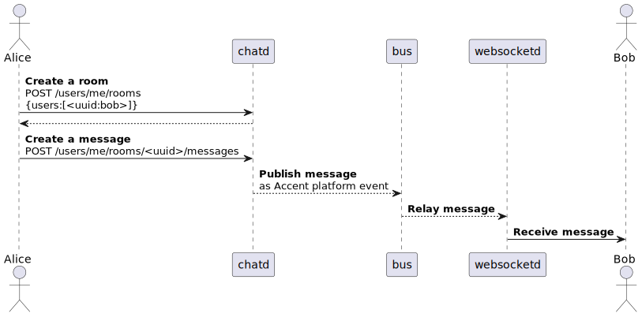

# [`chatd`](https://github/ryanwclark1/accent-chatd)

Add messaging functionality, as well as devices and users presence for a Accent Platform.

This is service accessible via REST API.

## Schema

## Usage example

## API documentation

The REST API for accent-chatd is available [here](../api/chat.html)

## Related

* [accent-amid](https://github/ryanwclark1/accent-amid)
* [accent-confd](configuration.html)
