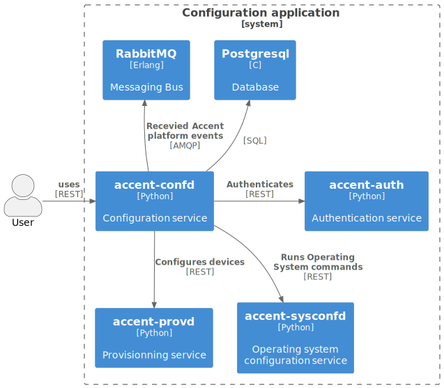

# [`accent-confd`](https://github/ryanwclark1/accent-confd)

Configuring and managing PBX part of Accent Platform.

* Agents
* Applications
* Asterisk configuration
* Call filters
* Call permissions
* Call pickups
* Conferences
* Configuration
* Contexts
* DHCP
* Devices
* Endpoints custom
* Endpoints iax
* Endpoints sccp
* Endpoints sip
* Extensions
* Function keys
* Groups
* High availability
* IVR
* Incoming calls
* Lines
* Music on hold
* Outgoing calls
* Pagings
* Parking lots
* Queues skills
* Queues
* Registers
* Sounds
* Switchboards
* Trunks
* Users
* Voicemails

## Schema

## First example

## Second example: Create a user with a phone and a voicemail

Setup workflow, details to create resources as described afterward:

* First, associate a `line` to an `extension ;
* Then, associate an `user` to the `line` ;
* Then associate an `endpoint` with the `line` ;
* Then associate a `device` with the `line` ;
* Finally, associate `voicemail` to the `user`.

## API documentation

The REST API for accent-confd is available [here](../api/configuration.html)

## REST API example

Create a user with a phone and a voicemail

## Related

* [accent-auth](https://github/ryanwclark1/accent-auth)
* [accent-confd-client](https://github/ryanwclark1/accent-confd-client)
* [accent-provd](https://github/ryanwclark1/accent-provd)
* [accent-sysconfd](https://github/ryanwclark1/accent-sysconfd)

## See also

* [Internal concepts](/uc-doc/system/accent-confd/developer)
* [Tools](https://github/ryanwclark1/accent-confd/blob/master/README.md)
