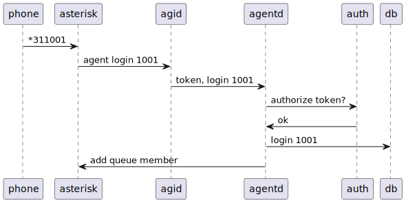
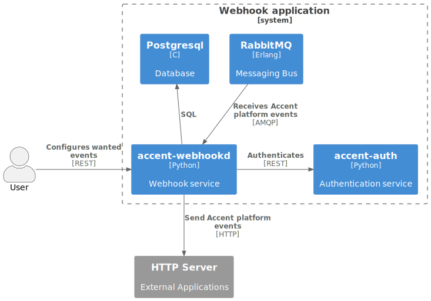
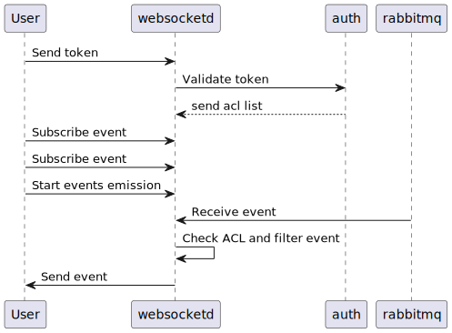

# agentd

accent-agentd is the service responsible of managing agent which are used to distribute calls received on queues in a call center use case.

It can do the following actions:

* log in
* log out
* pause
* resume

## Schema

## Example

#
# amid

## Description

A daemon for interacting with [Asterisk's AMI](https://docs.asterisk.org/Configuration/Interfaces/Asterisk-Manager-Interface-AMI) :

- forward AMI events to RabbitMQ ;
- expose HTTP JSON interface for AMI actions.

Once a user is authenticated against Accent platform, he can query the `amid` service to receive `AMI` events from Asterisk and push `AMI` command to it.

The `amid` service also proxies the AMI event to our event bus.

## Schema

# [auth]

accent-auth is the authentication server used by the Accent platform.

accent-auth is used to:

- create and store tokens
- validate tokens and permissions
- create and manage users
- create and manage user groups
- create and manage policies (named group of permissions).
- bootstrap third party authentication for Microsoft and Google
- store tokens for Google and Microsoft
- handle SAML authentication

## Schema

- accent-oauth2 is used to complete the OAuth 2.0 token creation process for third party authentications

## Example

## API documentation

The REST API for accent-auth is available [here](../api/authentication.html).

The bus events are defined [here](https://github/ryanwclark1/accent-bus/blob/master/accent_bus/resources/auth/events.py).

The database tables are defined [here](https://github/ryanwclark1/accent-auth/blob/master/accent_auth/database/models.py).

The SAML based login is available using SAML accent-auth APIs
To be able to use it you need to install the federation metadata XML file and add the corresponding configuration file.
## Policies

A policy is a list of access that is used to access Accent resources.
Policies can be created, deleted or modified using the REST API.

## Tokens

A token is used to identify and authorize all HTTP queries done on the accent-platform. Each token has an expiration
and can be revoked by the user.

The token should be added to each subsequent HTTP request using the 'X-Auth-Token' HTTP header.

## Service Authentication

Accent services expose more and more resources through REST API, but they also ensure that the access
is restricted to the authorized programs.

### Call flow

Here is the call flow to access a REST resource of a Accent service:

1. Create a username/password (also called service_id/service_key) with the right ACL.
2. Create a token with these credentials.
3. Use this token to access the REST resource requiring the ACL

TODO: Add a sequence diagram

- Service: Service who needs to access a REST resource.
- accent-{daemon}: Server that exposes a REST resource. This resource must have a required ACL.
- accent-auth: Server that authenticates the `Service` and validates the required ACL with the token.

Accent services directly use this system to communicate with each other, as you can see in their Web
Services Access.

# [dird](https://github/ryanwclark1/accent-dird)

accent-dird is the directory server for Accent. It offers a simple REST interface to query all directories that are configured.

View capabilities:

* default_json: present directory entries in JSON format
* headers: List headers that will be available in results from `default_json` view
* personal: Expose REST API to manage personal contacts
* phonebook: Expose REST API to manage accent-dird’s internal phonebooks.
* aastra: Expose REST API to search in configured directories for Aastra phone.
* cisco: Expose REST API to search in configured directories for Cisco phone
* polycom: Expose REST API to search in configured directories for Polycom phone.
* snom: Expose REST API to search in configured directories for Snom phone.
* thomson: Expose REST API to search in configured directories for Thomson phone.
* yealink: Expose REST API to search in configured directories for Yealink phone.

Backend capabilities:

* CSV: read directory entries from a CSV file.
* CSV Web Service: search using a web service that returns CSV formatted results.
* Phonebook: search the accent-dird’s internal phonebooks
* LDAP: search directory entries from an LDAP server.
* Personal: Add search results from the user personal contacts
* Accent: add users from accent-confd as directory entries
* Conference: add conferences from accent-confd as directory entries
* Google: add the user's personal Google contacts as directory entries
* Office365: add the user's personal Office365 contacts as directory entries

## Schema

* accent-phoned is a service that act as a proxy for phones and verify that the IP address of the phone is allowed to do a directory search before doing the HTTP request on dird on behalf of the phone.

## Example

## API documentation

The REST API for accent-dird is available [here](../api/contact.html)

The database tables are defined [here](https://github/ryanwclark1/accent-dird/blob/master/accent_dird/database/models.py)

The database is used to store:

* Personal contacts for each user
* Phonebook entries
* source and ID for favorites contacts
* directory source configuration
* directory profile configuration

## Terminology

### Back-end

A back-end is a connector to query a specific type of directory, e.g. one back-end to query LDAP servers, another back-end to query CSV files, etc.

### Display

A display is a lookup result formatting configuration. It defines the type, order, name and default values of each columns.

### Favorite

A favorite is a contact from any source that has been marked as favorite

### Profile

A set of configuration that is used when a user does a lookup or a reverse lookup. The profile includes which sources are used when doing a lookup, a reverse lookup and a favorite lookup. It also defines which `display` is used when doing a lookup.

### Source

A source is an instance of a back-end. One backend may be used multiples times to query multiple directories of the same type. For example, I could have the customer-csv and the employee-csv sources, each using the CSV back-end, but reading a different file.

### Plugins

A plugin is an extension point in accent-dird. It is a way to add or modify the functionality of accent-dird. There are currently three types of plugins:

Back-ends to query different types of directories (LDAP, CSV, etc.)
Views to expose directory results in different formats (JSON, XML, etc.)

 [provd](https://github/ryanwclark1/accent-provd)

accent-provd is the phone provisioning service for the Accent platform. It generates configuration files
for phones and gateways based on the plugins that are installed.

## Schema

## Example

## API documentation

The REST API for accent-provd is available [here](../api/provisioning.html)

## Plugins

Each model of phone must have its plugin supported by accent-provd. Plugins are located

Plugins are meant to be installed and upgraded independently of the OS to be able to use the firmware
version that works best for your use case.

## Auto provisioning

### How it works

Here's a simplified view of how auto-provisioning is supported on a typical SIP desktop phone:

1. The phone is powered on
2. During its boot process, the phone sends a DHCP request to obtain its network configuration
3. A DHCP server replies with the phone network configuration + an HTTP URL
4. The phone use the provided URL to retrieve a common configuration file, a MAC-specific
   configuration file, a firmware image and some language files.

Building on this, configuring one of the supported phone on Accent is as simple as:

1. dhcpd-config
2. Installing the required provd plugin
3. Powering on the phone
4. Dialing the user's provisioning code from the phone

And _voilà_, once the phone has rebooted, your user is ready to make and receive calls. No manual
editing of configuration files nor fiddling in the phone's web interface.

## Tenant assignation

On initial insertion into provd, devices are assigned to the tenant of the token used internally by
provd, which is the master tenant. When a device is provisioned, it is transferred to the tenant of
the line to which it is being associated. When the device is reset to autoprov, the device stays in
its tenant. It is not possible to change the tenant of the device once it is set. If you wish to do
it anyway, you must delete the device and restart it manually.

## Limitations

- Device synchronisation does not work in situations where multiple devices are connected from
  behind NAPT network equipment. The devices must be re-synchronised manually.
- There may be an issue if you are using an analog gateway with lines that are not in the same
  tenant. Indeed, in the case that the gateway is only one device and each port is a separate line,
  the device will only be seen by the tenant of the first line that was added.

# [`webhookd`](https://github/ryanwclark1/accent-webhookd)

Connect to Accent Platform event bus to push custom HTTP hooks to external
system. It manages the list of webhooks and triggers them when an event occurs.

Configurable via REST API.

## Schema

## Example

# [`websocketd`](https://github/ryanwclark1/accent-websocketd)

WebSocket server that delivers Accent Platform-related events to clients.

This ease in building dynamic web applications that are using events from your Accent.

## Schema

## Usage example

