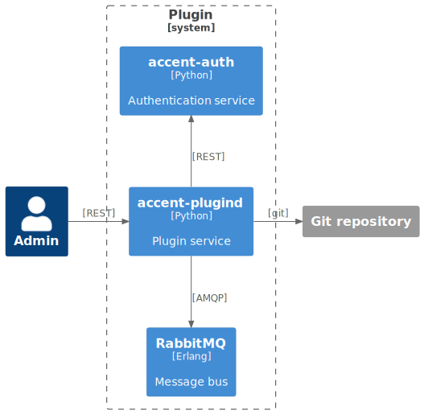
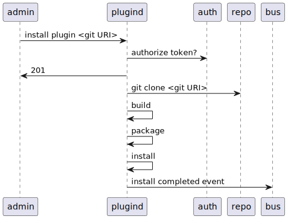

# [plugind](https://github/ryanwclark1/accent-plugind)

A service to manage plugins in the [Accent](https://accentvoice.io) platform.

accent-plugind allow the administrator to manage plugins installed on a Accent platform using
a simple HTTP interface.

It can:

- list available plugins
- install plugins
- uninstall plugins
- list installed plugins
- update plugins

## Schema

## Example

## API documentation

The REST API for accent-plugind is available [here](../api/plugins.html).

The bus events are defined [here](https://github/ryanwclark1/accent-bus/blob/master/accent_bus/resources/plugins/events.py).

## What is a plugin

A plugin is a set of additions made to a custom Accent platform installation to add a new functionality.

### What can be done with a plugin

Accent plugins allow a third party to add almost anything to Accent. Most of our services have extension points that can be used together to create a complete feature as a plugin.

- Add configuration files to accent services in /etc/\*/conf.d/
- Add configuration files and dialplan files to Asterisk
- Reload services to complete the installation
- Extend accent services using the available extension points

  - accent-auth
  - accent-calld
  - accent-confd
  - accent-dird
  - accent-confgend

## How it works

Given a plugin source accent-plugind will generate a debian package using the information provided in the `accent` directory.

The `plugin.yml` adds data that can be used to generate the debian packaging files.
The `rules` file is used to add actions during the installation and uninstallation process.

The generated Debian packages have the following names `accent-plugind-<plugin name>-<plugin namespace>`

## Related

[accent-auth](authentication.html)

## See also

- [Admin notes](plugins-admin.html)
