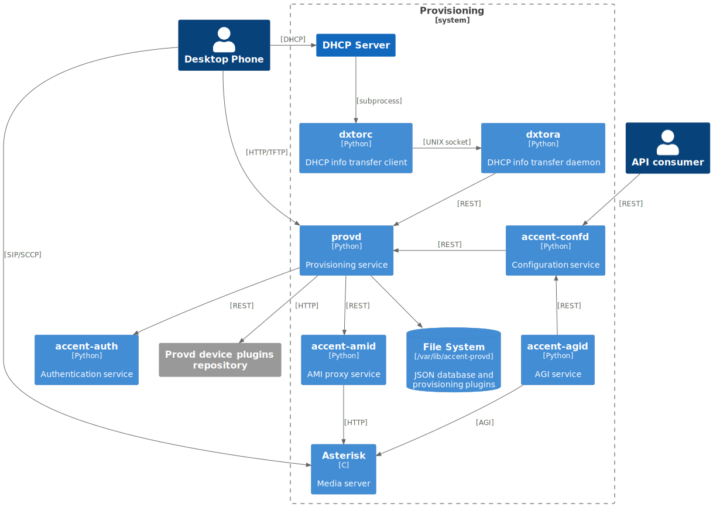

# [provd](https://github/ryanwclark1/accent-provd)

accent-provd is the phone provisioning service for the Accent platform. It generates configuration files
for phones and gateways based on the plugins that are installed.

## Schema

## Example

## API documentation

The REST API for accent-provd is available [here](../api/provisioning.html)

## Plugins

Each model of phone must have its plugin supported by accent-provd. Plugins are located
[here](https://github/ryanwclark1/accent-provd-plugins)

Plugins are meant to be installed and upgraded independently of the OS to be able to use the firmware
version that works best for your use case.

Supported plugins are hosted on
[provd.accent.community](https://provd.accent.community/plugins/2/stable/)

## Auto provisioning

### How it works

Here's a simplified view of how auto-provisioning is supported on a typical SIP desktop phone:

1. The phone is powered on
2. During its boot process, the phone sends a DHCP request to obtain its network configuration
3. A DHCP server replies with the phone network configuration + an HTTP URL
4. The phone use the provided URL to retrieve a common configuration file, a MAC-specific
   configuration file, a firmware image and some language files.

Building on this, configuring one of the supported phone on Accent is as simple as:

1. dhcpd-config
2. Installing the required provd plugin
3. Powering on the phone
4. Dialing the user's provisioning code from the phone

And _voilà_, once the phone has rebooted, your user is ready to make and receive calls. No manual
editing of configuration files nor fiddling in the phone's web interface.

## Tenant assignation

On initial insertion into provd, devices are assigned to the tenant of the token used internally by
provd, which is the master tenant. When a device is provisioned, it is transferred to the tenant of
the line to which it is being associated. When the device is reset to autoprov, the device stays in
its tenant. It is not possible to change the tenant of the device once it is set. If you wish to do
it anyway, you must delete the device and restart it manually.

## Limitations

- Device synchronisation does not work in situations where multiple devices are connected from
  behind NAPT network equipment. The devices must be re-synchronised manually.
- There may be an issue if you are using an analog gateway with lines that are not in the same
  tenant. Indeed, in the case that the gateway is only one device and each port is a separate line,
  the device will only be seen by the tenant of the first line that was added.

## External links

- [Introduction to provd plugin model](/uc-doc/contributors/provisioning/introduction-to-the-plugin-model-of-the-new-provisioning-server)
- [HTTP/TFTP requests processing in provd - part 1](/uc-doc/contributors/provisioning/httptftp-requests-processing-in-provd-part-1)
- [HTTP/TFTP requests processing in provd - part 2](/uc-doc/contributors/provisioning/httptftp-requests-processing-in-provd-part-2)

## Related

- [accent-amid](amid.html)
- [accent-auth](authentication.html)
- [accent-confd](configuration.html)

## See also

- [Admin notes](provisioning-admin.html)
