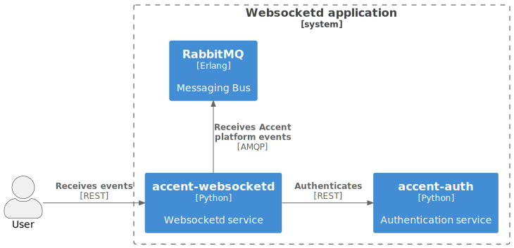
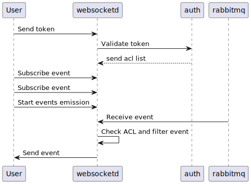

# [`websocketd`](https://github/ryanwclark1/accent-websocketd)

WebSocket server that delivers Accent Platform-related events to clients.

This ease in building dynamic web applications that are using events from your Accent.

## Schema

## Usage example

## See also

* [Dev notes](websocket-app.html)
